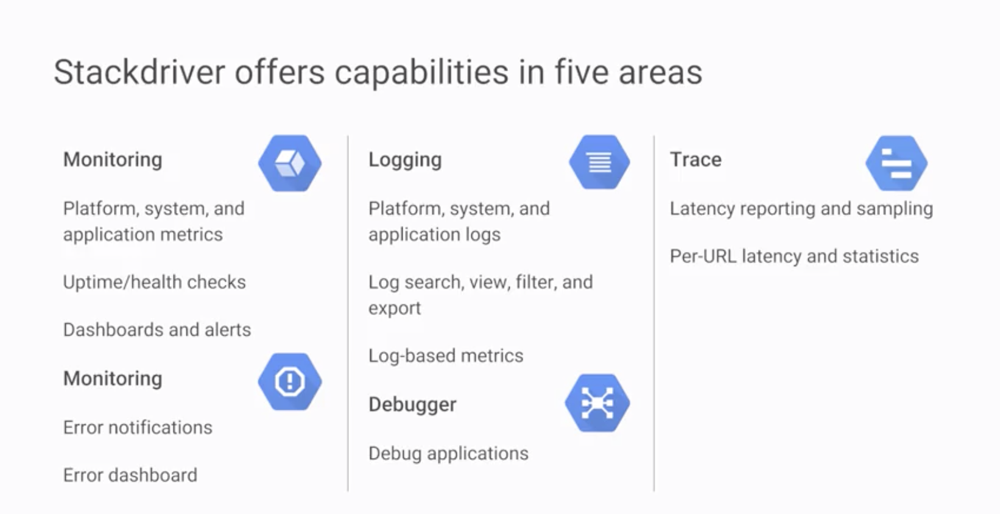

# Stackdriver

## Monitoring

- Gather metrics
- Make improvements
- Increase reliability
- Detect and fix security issues
- Reduce costs based on usage patterns
- Compare experimental configurations
- Raise alerts if something broken (about broken)
210831107
1. Metrics: 
    * Platform 
    * System 
    * Application
    * Custom Types: 

2. Uptime/health check: 

3. Dashboard

- Four golden signals
    * Latency
        - overall time of successful request
    * Traffic
        - Number of read/write per second
        - Number of HTTP/S request per second
    * Errors
        - Number fail requests
        - 500
        - 200 with over limitted time

    * Saturation

4. Alerts:
    * Based on Metric
    * Raise alerts
    * SLI service-level Indicator --> latency
    * SLO service-level Objective --> 99.9% of requests over 30 days have latency < 100ms

## Logging: 

Cloud Dataflow, Cloud function, App Engine have built-in support for logging

Kubernetes: enable via container cluster set up

Search, view, filter, export(Big query, Cloud PubSub, Cloud Storage)

1. Platform

2. System

3. Application

4. Base on Metrics

## Dianostics

Identifying and troubleshooting performance issues

Development
- Performance test
- Web authoring
    + Design
    + Implementation
    + Page speed
- Review code and logs
    + Application errors
    + Runtime code gen
    + Static resources
    + Caching
    + One at a time retrieval
    + Error handling
- Cold-boot performance
    + initial boot of VM
- Self-inflicted Load
    + service-to-service
    + browse-to-service

Production

### Debug
1. Application
2. With source code from Cloud Source repo

### Error Reporting
1. SLOs and SLAs
2. Error notifications
3. Error dashboard

### Trace
- Latency report
- Per URL latency/statistics

## Summary

