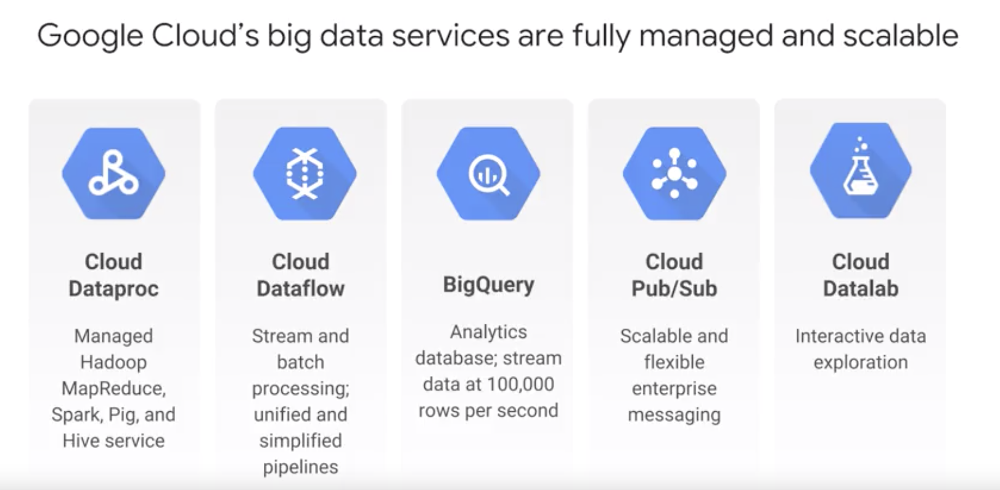

~~## Serverless platform~~

Fully managed and scalable with GCP

## Cloud Dataproc
- Well known size of data
- Working with Apache Hadoop open source software
- Apache Hadoop base on MapReduce programming model (by Google)
- Request GCP Hadoop cluster (build on top of Compute Engine)
- Control number, type of nodes in Cluster
- Scalable
- Billing charge by used hours, clusters 
- On-premise: need to invest hardware <> Cloud Dataproc: pay only when use cluster to process data, can use preemptible VM(batch processing) to save up to 80% cost

## Cloud Dataflow
- Unpredictable size, rate
- Data shows up in real time
- Auto scale, no instance provisioning required
- extract, computation, load batch computation, continuous computation
- Pipeline: source transform ...
- Use with GCP services: Storage, PubSub, BigQuery, BigTable

## Big Query
- analyze data
- SQL query on massive data
- GCP manage, no cluster maintainance 
- Easy to read and write data from DataFlow
- Billing by query
- DataSet can be shared, and billing will be charged for shared user who do query

## Cloud Pub/Sub
- At least once delivery: small change can be delivery ...

## Cloud Datalab