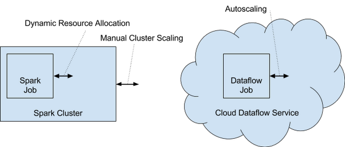

## Concepts
- run in cloud
- autoscaling
- intelligently scale: not only the `workers` but also the tasks to keep workers busy
- scale by
    * CPU utilization
    * amount of work remaining (or backlog)
    * dataflow will learn the size and throughput of the `job` in order to scale more `workers`
    * scale up or down by above conditions
- ideal for
    * Streaming data
    * Batch data

## Compare with running Spark

### Spark
- have to configure
- coordinate and monitor two limited scaling interfaces

### Dataflow
- Single interface
- intelligently scale