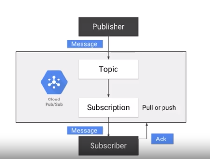
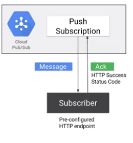

## Concepts



- enable loosely coupled integration between application components
- dont have to developing code to manage concurrency or scaling
- auto scale by workloads


## Pull subscription 


- Use in Data Flow
- Implement with google cloud library
- Call the `pull` method and `ack` by id
- process very large volume of messages with high throughput

## Push subscription



- Send the messages as an HTTP request to subcriber at pre-configured HTTP endpoint, and return the HTTP status code
- The push endpoint can be a load balancer or Google App Engine 


## User cases
### Can deploy your subcriber code as cloud functions or dataflow
- Will be triggered whenever a new message received
- highly scalable subscribers

### Deploy subscribers on GCE, GAE, GKE
- Auto scale by Stack driver metrics


## Development
### Publish by gcloud
- Create the topic `feedback`
- `Create subscription` `cloud-shell-subscription` against the topic `feedback`
```
gcloud beta pubsub subscriptions create cloud-shell-subscription --topic feedback
```
- `Publish` message to a topic `feedback`
```
gcloud beta pubsub topics publish feedback  --message "Hello world"
```
- `Pull` message from subscription `cloud-shell-subscription`
```
gcloud beta pubsub subscriptions pull cloud-shell-subscription --auto-ack
```

### Publish by code
- Load pubsub module 
```
const Pubsub = require('@google-cloud/pubsub');
```
- Create `pubsub` instance of current G  Cloud project
```
const pubsub = Pubsub({
    projectId: config.get('GCLOUD_PROJECT')
});
```
- Load the topic
```
const topic = pubsub.topic('feedback');
```
- Publish the message
```
topic.publish({
    data: feedback
});
```
- Create subscription:
```
topic.subscribe(`new_subscription`, { autoAck: true }).then( result => {
    const subscription = result[0];
    // Invoke callback
    subscription.on('message', message => {
        cb(message.data);
    });

    subscription.on('error', err => {
        console.error(err);
    });
});
```

