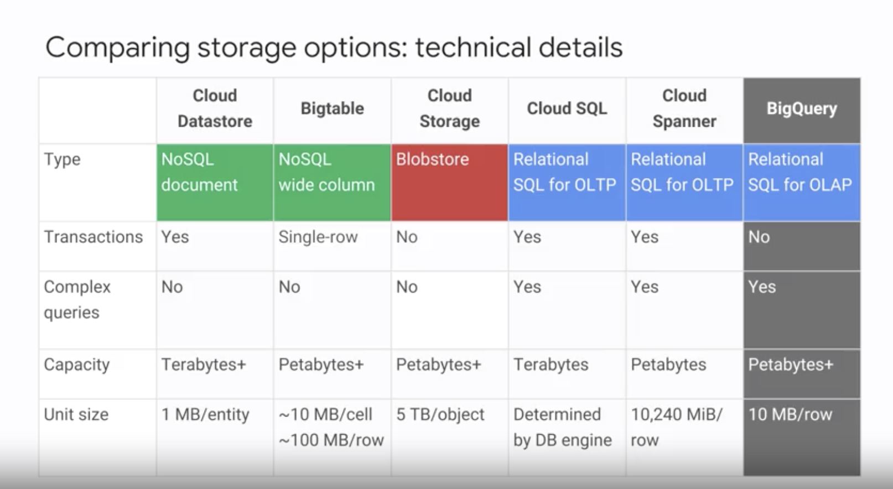

## Group of services from GCP


## Compare storage option




## Notes
IaaS Infastructure as services
* Compute Engine

SaaS Software as services

PaaS Platform as services: 
* App Engine

Hybrid: 
* Kubernetes Engine

## Get response code by curl
```
curl -o /dev/null -s -w "%{http_code}\n"  http://$EXTERNAL_IP
```

## `sed` command
```
sed -i -e 's/PROJECT_ID/'$DEVSHELL_PROJECT_ID/ mydeploy.yaml
sed -i -e 's/ZONE/'$MY_ZONE/ mydeploy.yaml
```

## Creates an artificial CPU load 

It forces the CPU to continuous attempt to compress random data
```
dd if=/dev/urandom | gzip -9 >> /dev/null &
```

## IAM concepts

- Permissions are represented with the following syntax
<service>.<resource>.<verb>


## Useful commands
Copy file to instance
```
gcloud compute scp <file> <instance name>:~\...
```
Rename multi files
```
find . -type f -name 'notes.md' -execdir mv {} readme.md \;
```

## O Auth 2.0 Web flow

## Using services account key json

```
export GOOGLE_APPLICATION_CREDENTIALS="<path to service account json file>"
```


## CLOUD SECURITY SCANNER
Automatically scan your App Engine, Compute Engine, and Google Kubernetes Engine apps for common vulnerabilities


Petabyte `Transfer Appliance`
Intermittent timeout - `VPC` flow logs
