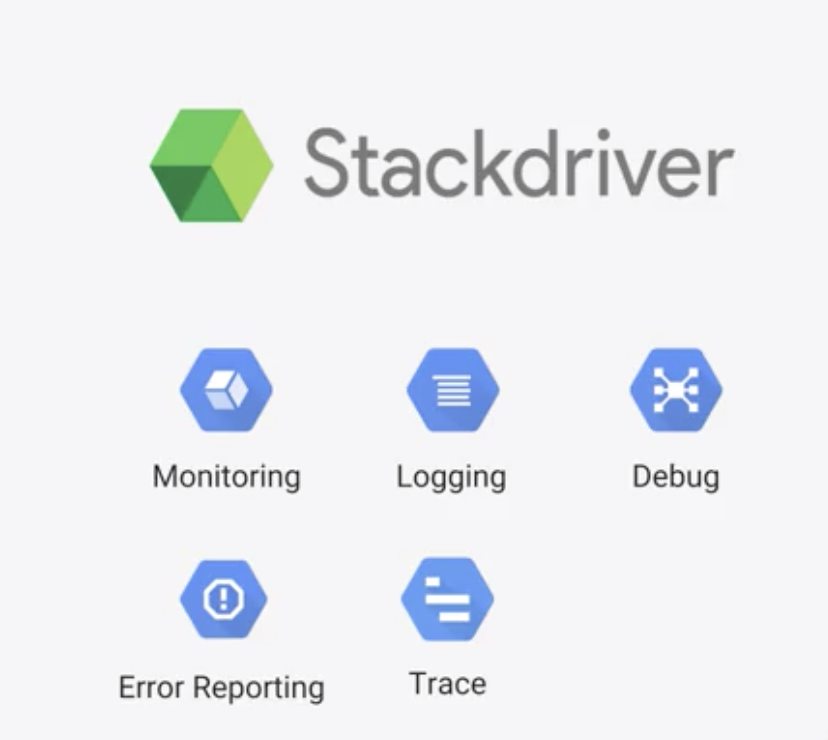

## Monitoring
1. Metrics: 
    * Platform 
    * System 
    * Application

2. Uptime/health check: 

3. Dashboard

4. Alerts

## Logging: 

Search, view, filter, export(Big query, Cloud PubSub, Cloud Storage)

1. Platform

2. System

3. Application

4. Base on Metrics

## Dianostics

### Debug
1. Application
2. With source code from Cloud Source repo

### Error Reporting
1. SLOs and SLAs
2. Error notifications
3. Error dashboard

### Trace
- Latency report
- Per URL latency/statistics

## Summary

